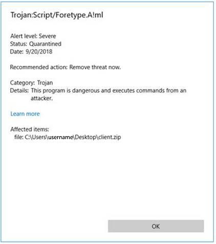

# Confusion matrix

When downloading a zip file that i've created i get the following message in my Windows operating system:

However, I am sure that the zip file does not contain any malware.
In this case we speak of a "false positive". False positives are located in a so-called "confusion matrix".

Find & document definitions for the terms below in function of the confusion matrix:

- True positive
- False negative
- True negative
- False positive